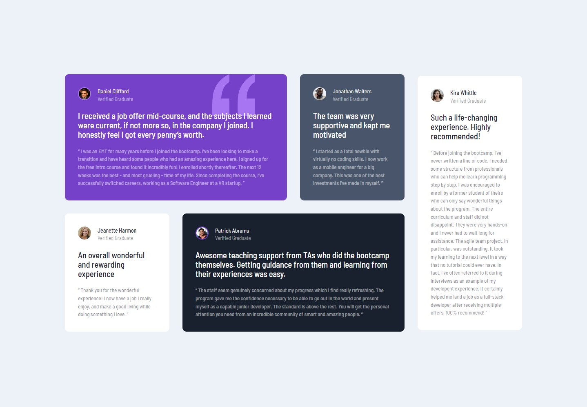

# Testimonials grid section solution

This is a solution to the [Testimonials grid section challenge on Frontend Mentor](https://www.frontendmentor.io/challenges/testimonials-grid-section-Nnw6J7Un7).

## Table of contents

- [Overview](#overview)
  - [The challenge](#the-challenge)
  - [Screenshot](#screenshot)
  - [Links](#links)
- [My process](#my-process)
  - [Built with](#built-with)
- [Acknowledgments](#acknowledgments)

## Overview

### The challenge

Users should be able to:

- View the optimal layout for the site depending on their device's screen size

### Screenshot

#### Desktop

#### Mobile

### Links

- Solution URL: [Code](https://github.com/hellcsaba/testimonials-grid)
- Live Site URL: [Testimonials grid live](https://hellcsaba.github.io/testimonials-grid/)

## My process

### Built with

- Semantic HTML5 markup
- CSS custom properties
- Flexbox
- CSS Grid
- Mobile-first workflow
- BEM notation

## Author

- Website - [Csaba Hell](https://github.com/hellcsaba)
- Frontend Mentor - [@hellcsaba](https://www.frontendmentor.io/profile/hellcsaba)
- LinkedIn - [@csabahell](https://www.linkedin.com/in/csabahell/)
